# Eco-Friendly Witches: Improving Generalization Through Suspension of Disbelief for Zero-Shot Relation Extraction
Code, data, and supplementary results for the KCAP 2025 submission "Eco-Friendly Witches: Improving Generalization Through Suspension of Disbelief for Zero-Shot Relation Extraction".

Link to paper: https://doi.org/10.1145/3731443.3771346

## Requirements
The python version we used is `3.11.7`.
There is a requirements.txt file with the top-level Python libraries needed for the experiments, the remainder should be dependencies of those and be automatically fetched.
If this doesn't work, requirements_full.txt contains a `pip freeze` dump from our environment, that may help in debugging any dependency issues.
Other libraries may be needed to do the plotting/visualization.
There is a data dependency; see the next section.

## Data
For the under-review version of this repository, all data is provided under the `data` folder.
You may disregard the remainder of this section and skip to `Experiments`.

### Re-DocRED
You will need the original Re-DocRED files.
The instructions for that can be found here: https://github.com/tonytan48/Re-DocRED.
Place `dev_revised.json` and `test_revised.json` in `data/re-docred` and optionally include `train_revised.json`.
We have already provided slightly modified versions of these files which correct some unicode character strangeness, and removed the _revised from the file names.
We have also provided `dev_c.json`, which is a combination of the dev and test files, since those consitute the same 1000 documents from the original DocRED dataset's dev file.
We have also included an extended version of `rel_info.json` there that includes the prompts that were used in the experiments along with other annotations, such as domain and range.
Unused annotations are placeholders and may be incorrect.

### DocShRED
Once you have downloaded Re-DocRED, you will need to generate DocShRED.
This can be done using the notebook called `shuffle_docred.ipynb`.
Because of the unicode issues mentioned above, we have also provided dev, test, train, and dev_c files for DocShRED-4423[LMOP] used in the paper, along with a duplicate of `rel_info_full.json`.

### BioRED
You will also need the original BioRED files.
These can be found at https://ftp.ncbi.nlm.nih.gov/pub/lu/BioRED/.
Extract the contents of `BIORED.zip` into the folder `data/biored`.
Please do not overwrite `rel_info_full.json`.
You will also need to run the provided conversion script to convert the BioRED data to one that mimicks the DocRED format: `biored_converter.py`.

## Experiments
To run the experiments, run the following commands from the root directory:

`python EntitySubstituteTest.py <Blanks> <Passes> <DataDir> <Task>   <Set> <Result Folder> <Batch Size> <Model Name>     <Start At>`

`python EntitySubstituteTest.py 2        3        data      re-docred   dev_c   res             1000         bert-large-cased 0`

`python EntitySubstituteTest.py 2        3        data      re-docshred dev_c   res             1000         bert-large-cased 0`

`python EntitySubstituteTest.py 2        3        data      re-docred   dev_c   res             1000         roberta-large    0`

`python EntitySubstituteTest.py 2        3        data      re-docshred dev_c   res             1000         roberta-large    0`

`python EntitySubstituteTest.py 2        3        data      biored   train res             1000         bert-large-cased 0`

`python EntitySubstituteTest.py 2        3        data      biored   train res             1000         biobert          0`

`python EntitySubstituteTest.py 2        3        data      biored   train res             1000         pubmedbert       0`

All parameters have defaults, so the most important parameters to set are `Task`, `Set`, and `Model Name`.
There are some predefined aliases that can be used for the `Model Name`, they are shown above.
For example, `biobert` is an alias for `dmis-lab/biobert-large-cased-v1.1`
These last two are optional and can be adjusted depending on if there are memory issues and what kind those are.
`Start At` starts the experiments at a particular document index, useful if you run out of memory and the batch size needs to be lowered.
This process can also be sped up by running the code on multiple machines and pointing `res` to a shared folder, though you have to take care not to duplicate work.
Note that both `Blanks` and `Passes` parameters specify the maximum value to be tested.
So setting `Blanks=2` and `Passes=3` means that the combinations (0,0), (0,1) (0,2), (1,1), (1,2), (2,1), and (2,2) will be tested.
There's an off-by-one error somewhere so `Passes` needs to be one higher than the actual number of passes you wish to run.
Also, note that when using blanks (entity isolation), results for `Passes=0` are invalid.
The ranking scores will look good, but *all* statements for a relation will be given identical scores.
The sorting is then done by the order of appearance in a document, and the first entity in a document usually has some relation with the first few other entities...

## Unaggregated Results
This files currently under `res/html` contain the raw results from the paper used to generate the figures (both in the paper and at the end of this README).
These are given as HTML pages, so may need to be downloaded.

If the results are not fully cleaned up, keep in mind that for `Passes > 0` you will need to read the row `Top-10` instead of `None`, and for `Passes = 0` you will need to read the row `None`.

## MRER scores
These are calculated via the `calculate_mrer.ipynb` notebook.
The notebook should still contain output showing the exact values.

## Generating results pages
You can generate the html files with the results by running the first few cells of `Scoring.ipynb`.
By default it will generate each file once and quit, but you can un-comment the infinite loop to make it constantly read and report the results as you run the experiments.
This file may need modification to point to the correct folder under `res` holding your experimental results.
The html files use a refresh tag, and so will automatically update when the file changes after about a minute.

## Docker
Docker is not necessary to run this project, we simply used docker containers to parallelize the experiments across the machines available to us.
`build.sh`, `run_exp.sh`, and the `images/` folder are all there to support that infrastructure.
However, the underlying python scripts can be run on any CUDA-enabled machine.
If you do wish to run this via docker, an example command would be:
`./build.sh && ./run_exp.sh 2 3 data re-docred dev res 1000 bert-large-cased 0 && docker logs --follow disbelief`
This is the same experiment as the first command from above.

## Additional figures
If you're interested in the results for other DocShRED experiments, the following figures give an overview of their results.
### MRER for BERT, Contextualization = 1 pass, Isolation = 1 pass and 1 blank
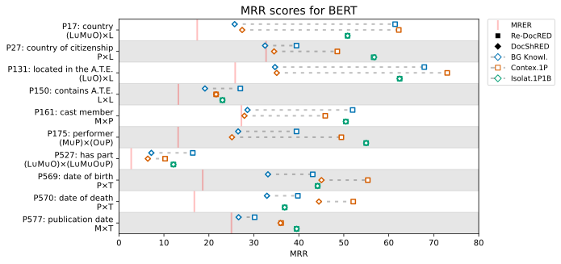

### MRER for BERT, Contextualization = 1 pass, Isolation = 1 pass and 2 blanks
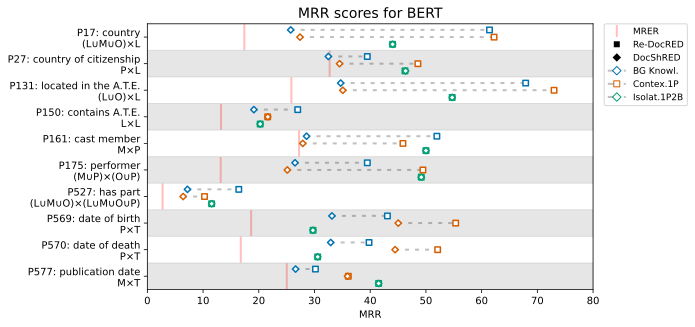

### MRER for BERT, Contextualization = 2 pass, Isolation = 2 passes and 1 blank

### MRER for BERT, Contextualization = 2 pass, Isolation = 2 passes and 2 blanks
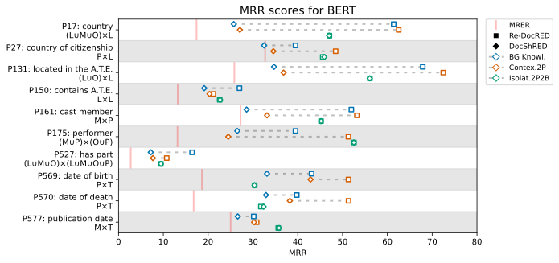

### MRER for RoBERTa, Contextualization = 1 pass, Isolation = 1 pass and 1 blank
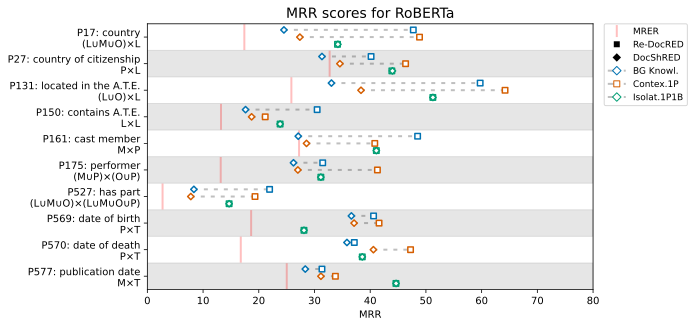

### MRER for RoBERTa, Contextualization = 1 pass, Isolation = 1 pass and 2 blanks
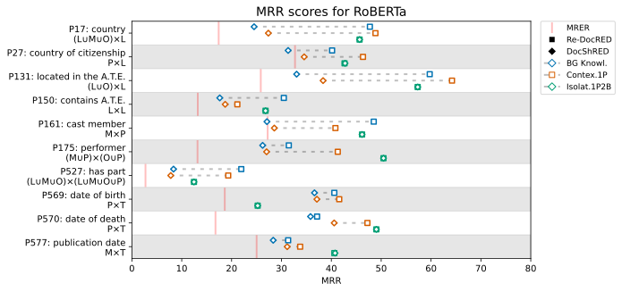

### MRER for RoBERTa, Contextualization = 2 passes, Isolation = 2 passes and 1 blank
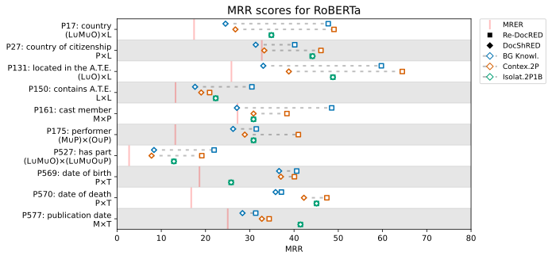

### MRER for RoBERTa, Contextualization = 2 passes, Isolation = 2 passes and 2 blanks
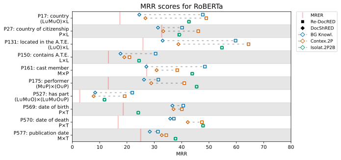

## Additional figures (Original DocRED)
The following figures were generated using the original DocRED data set, and DocShRED-4423[LMOP] generated based on the original DocRED data set.

### MRER for BERT, Contextualization = 1 pass, Isolation = 1 pass and 1 blank
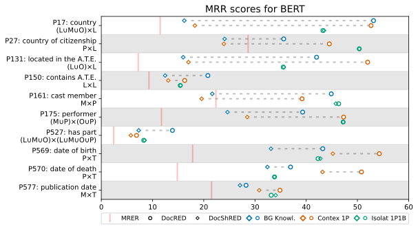

### MRER for BERT, Contextualization = 1 pass, Isolation = 1 pass and 2 blanks
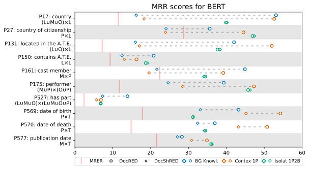

### MRER for BERT, Contextualization = 2 pass, Isolation = 2 passes and 1 blank
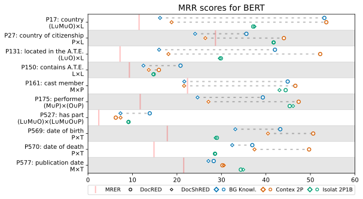

### MRER for BERT, Contextualization = 2 pass, Isolation = 2 passes and 2 blanks
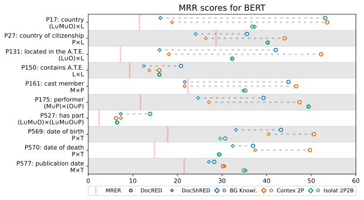

### MRER for RoBERTa, Contextualization = 1 pass, Isolation = 1 pass and 1 blank
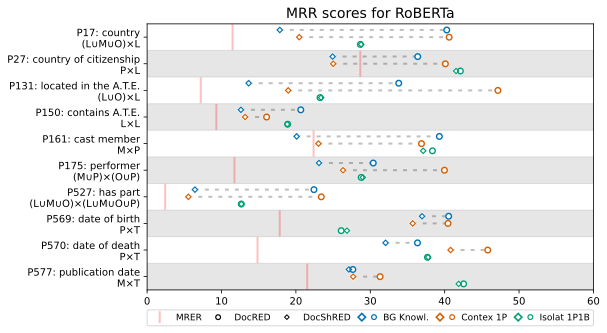

### MRER for RoBERTa, Contextualization = 1 pass, Isolation = 1 pass and 2 blanks
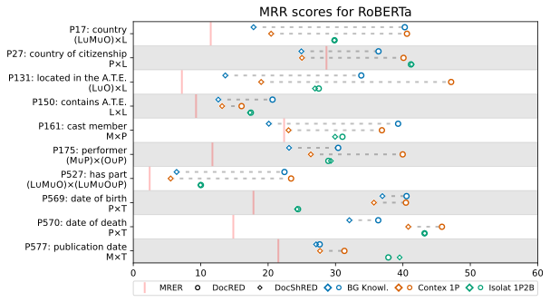

### MRER for RoBERTa, Contextualization = 2 passes, Isolation = 2 passes and 1 blank
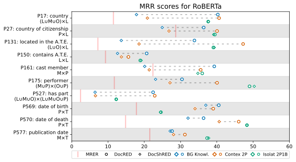

### MRER for RoBERTa, Contextualization = 2 passes, Isolation = 2 passes and 2 blanks
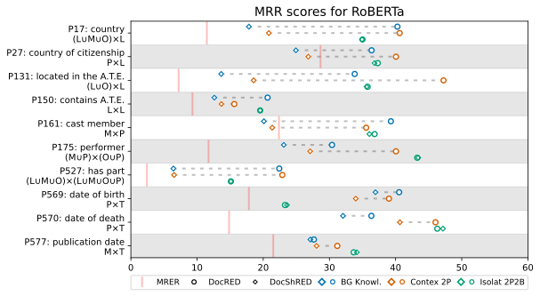

